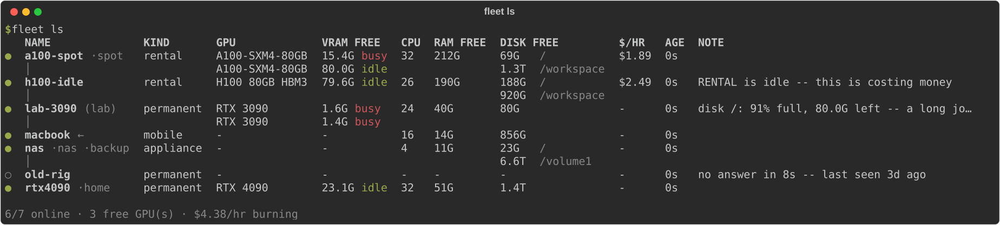
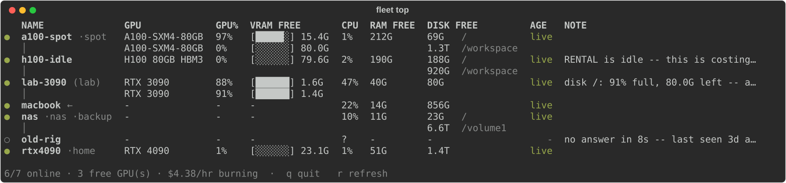

<!-- mcp-name: io.github.lion-zhang/fleet -->
<div align="center">

# fleet — let your coding agent use every machine you have

**Claude Code, Codex and Gemini see one machine: the one they run on.<br>
fleet shows them all of yours — every GPU, how much is free, and how to get there.**

[](https://github.com/lion-zhang/fleet/actions/workflows/test.yml)
[](LICENSE)




</div>

## The problem

Ask your agent to train a model and it starts on your laptop — while a 4090 sits idle
across the room and a rented A100 bills you by the hour. It cannot use what it cannot see.

- **Your agent is stuck on one machine.** It has no idea your other boxes exist.
- **Finding a free GPU is manual.** SSH into five hosts, run `nvidia-smi`, compare in your head.
- **Handing it a server means pasting credentials** into the chat, and hoping.

## With fleet

You ask in words. The agent checks every machine and picks the right one:

> **You:** train `train.py` on whatever has a free 24 GB card
>
> **Agent:** runs `fleet ls --tag cuda --tag vram-24g --json` — `rtx4090` has 23.1 GB free
> and an idle GPU; `a100-spot` is free too but costs $1.89/hr. Starting on `rtx4090`:
> `fleet ssh rtx4090 -- 'cd ~/proj && nohup python train.py > train.log 2>&1 &'`

| You say | The agent runs |
|---|---|
| "what's free right now?" | `fleet ls --json` |
| "find me a box with a 24 GB card" | `fleet ls --tag cuda --tag vram-24g --json` |
| "what's costing me money?" | `fleet ls --json`, and reads the idle-rental alerts |
| "run the tests on the Linux box" | `fleet ssh linux-box -- 'cd proj && pytest'` |
| "add my new rental, `ssh -p 40001 root@1.2.3.4`" | `fleet add "ssh -p 40001 root@1.2.3.4"` |

No hostnames, keys or passwords ever go into the conversation.

## Install

On the machine you work from:

```bash
curl -LsSf https://raw.githubusercontent.com/lion-zhang/fleet/main/install.sh | sh
```

<sub>Windows: `powershell -ExecutionPolicy ByPass -c "irm https://raw.githubusercontent.com/lion-zhang/fleet/main/install.ps1 | iex"`</sub>

That is the whole setup. This machine becomes your fleet's **center**, and every coding
agent installed on it learns to use fleet. Now add your other machines:

```bash
fleet add "ssh root@gpu-box"      # any SSH command you already use; nothing is installed there
fleet invite gpu-box              # or: prints one line to paste on gpu-box, which joins by itself
```

Every machine besides the center is a **member**. A member needs nothing installed — just
sshd. Paste the `fleet invite` line on machines where you also want to *run* fleet, or
where you would rather not type a password: it installs fleet there and joins with no
password at all.

### Already in your agent? Install from there

| Agent | Install |
|---|---|
| **Claude Code** | `/plugin marketplace add lion-zhang/fleet` then `/plugin install fleet@fleet` |
| **Codex** | `codex plugin marketplace add lion-zhang/fleet` then `codex plugin add fleet@fleet` |
| **Gemini CLI** | `gemini extensions install https://github.com/lion-zhang/fleet` |
| **GitHub Copilot CLI** | `copilot plugin marketplace add lion-zhang/fleet` then `copilot plugin install fleet@fleet` |
| **Cursor** | [](https://cursor.com/en/install-mcp?name=fleet&config=eyJjb21tYW5kIjoidXZ4IiwiYXJncyI6WyJhZ2VudC1mbGVldCIsIm1jcCJdfQ==) |
| **VS Code** | [](https://insiders.vscode.dev/redirect/mcp/install?name=fleet&config=%7B%22command%22%3A%22uvx%22%2C%22args%22%3A%5B%22agent-fleet%22%2C%22mcp%22%5D%7D) |
| **Claude Desktop** | open `fleet.mcpb` from the [latest release](https://github.com/lion-zhang/fleet/releases/latest) |

Plus OpenCode, Amp, Windsurf, Cline, Zed, Qwen Code, Goose, Hermes and more:
**[every agent →](docs/agents.md)**

## Built to be safe

- **Nothing to install on your machines.** fleet probes with one script over one SSH
  connection — Linux, macOS or Windows. A NAS or a fresh rental works as it is.
- **Keys, not passwords.** A password, if needed at all, is typed once by you. Nothing
  that could be stolen is stored, and the agent never sees a credential.
- **Access you control.** The center decides which machine may reach which, and a revoke
  is pushed at once. `fleet access gpu-box --allow laptop`, `--deny` to take it back.
- **The agent asks, not guesses.** It is told to ask which machine you mean, and to leave
  irreversible commands to you.

## Also for you, not just your agent

```bash
fleet ls                            # every machine, with what is free right now
fleet top                           # live view, like htop for the whole fleet
fleet show gpu-box                  # one machine in detail: GPU processes, services, disks
```



Rentals from vast.ai, RunPod or Lambda show their price (`fleet edit a100 --cost 1.89`),
the fleet's burn rate, and an alert when a paid machine sits idle. On Tailscale, ZeroTier
or WireGuard? fleet just needs an address it can route to.

## How fleet compares

fleet is about the machines you already have. It complements tools that launch new ones.

| | `ssh` + `nvidia-smi` | nvitop / gpustat | SkyPilot / dstack | **fleet** |
|---|:---:|:---:|:---:|:---:|
| All your machines in one view | ✗ | ✗ one machine | ✓ the ones it manages | ✓ |
| Built for coding agents (skill / MCP) | ✗ | ✗ | partly | ✓ |
| Nothing installed on target machines | ✓ | ✗ | ✗ | ✓ |
| Manages SSH access between machines | ✗ | ✗ | for its own clusters | ✓ |
| Launches new cloud VMs | ✗ | ✗ | ✓ | ✗ |

## FAQ

<details>
<summary><b>What does my agent actually get?</b></summary>

Agents with a shell (Claude Code, Codex, Gemini CLI, …) get a skill that tells them the
`fleet` commands; it costs nothing until a task needs a machine. Desktop apps (Claude
Desktop, Cursor, VS Code, …) get an MCP server. The installer sets up whichever agents
you have; [docs/agents.md](docs/agents.md) has the details for each.
</details>

<details>
<summary><b>Does it work behind NAT, or across sites?</b></summary>

The center needs an address it can route to: a public IP, a LAN, or an overlay such as
Tailscale. A machine the center cannot dial can still join with the `fleet invite` line
and report in; granting access to it waits until the center can reach it.
</details>

<details>
<summary><b>What if the center is off?</b></summary>

Normal — it can be a laptop that is closed half the day. Everything already granted keeps
working; only changes wait for it. Move the role with `fleet center NAME`.
</details>

<details>
<summary><b>Windows?</b></summary>

Windows machines work as targets with nothing to configure, and fleet runs on Windows,
center included.
</details>

## Learn more

- [Getting started](docs/getting-started.md) — the full walkthrough, every command
- [Every agent](docs/agents.md) — install commands and config for 20+ agents
- [Design](docs/design/access.md) — how access is granted, signed and revoked

**Status:** v0.5. Every command has been run end to end on fleets of Linux machines built
from scratch; the test suite runs on Linux and macOS. Windows works as a target and a
center, and is less tested.

Issues and pull requests are welcome — `uv run pytest -q` runs the tests. If fleet saved
you a GPU-hour, a ⭐ helps other people find it.

[MIT](LICENSE)
