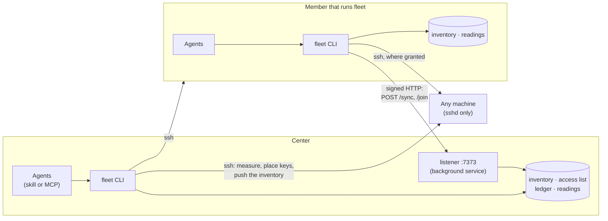

# How fleet works

This page follows fleet through what it does — from installing to running a job — and
names the parts involved at each step. The pages beside it go deeper into two of them:
[access](access.md) (keys, signing, handover, the threat model) and [sync](sync.md) (how
machines share what they know).

## The parts

| Part | What it is |
|---|---|
| **The `fleet` CLI** | Everything fleet does is a `fleet` command. Installed once per machine, shared by every agent on it. ([why](layers.md)) |
| **Skill** | Text written into each agent's skill folder by `fleet setup`, telling it which command to use for what. No code. |
| **MCP server** | `fleet mcp`, launched by apps that cannot run commands. Each tool runs one `fleet` command and returns its output. |
| **Inventory** | `inventory.yaml`: the machines, their addresses, names, tags and cost. Every machine has a copy. |
| **Readings** | `cache.db`: the latest measurements. Disposable. |
| **Access list** | `access.yaml`, on the center only: which machine's key may be in which machine's `authorized_keys`. |
| **Ledger** | On the center: what is actually in place on each machine, and what is pending. |
| **Keys** | Every machine in the fleet has a fleet key of its own, `id_ed25519` in fleet's folder. The center's key is in every machine's `authorized_keys`. |
| **Listener** | On the center, port 7373: answers members asking for fresh information, and machines joining with an invite. Kept running by a background service. |

## Installing

The installer gets [uv](https://docs.astral.sh/uv) if it is missing, and installs the
`agents-fleet` package with it — unless some copy of fleet is already on the machine, in
which case it keeps that one. Then it runs `fleet setup`:

1. **On a machine in no fleet, a new fleet starts**, with this machine as its center: a
   fleet key is generated, an empty access list is written with a new fleet id, the
   machine records itself in the inventory, and the background service is installed.
   (This happens on the first fleet command on such a machine, whatever it is; the
   installer is just the usual first one.)
2. **Each agent installed here is taught fleet.** `fleet setup` looks for the agents it
   knows by their folders, writes the skill where each one reads skills —
   `~/.claude/skills`, the shared `~/.agents/skills`, Hermes' own — and registers the MCP
   server in the config of apps without a shell. It leaves everything else in those
   files alone. Each skill is stamped with a hash of its text, so `fleet ls` can tell
   when an agent is reading an older one.

Joining instead (`--join CODE`) installs the same CLI and runs `fleet join`; see
[Invites](#a-machine-joins-by-itself) below.

## Adding a machine

`fleet add "ssh ubuntu@10.0.0.7"`, on the center:

1. **The ssh command is parsed** the way ssh would read it: `-p`, `-i`, `-J`, and the
   matching `Host` in `~/.ssh/config` with its user, port, key and `ProxyJump`.
2. **The machine is measured** over that connection, letting your ssh-agent and config
   offer their keys this once. If it does not answer, nothing is recorded.
3. **The record is written** to the inventory, through the
   [write queue](#several-agents-at-once).
4. **The center's key is placed** in the machine's `authorized_keys`, inside a block
   marked with the fleet id. If no key of yours got in, this is where a password is asked
   for — typed by you, used for this one connection, and kept nowhere.
5. **The machine gets a fleet key of its own**, created there if it has none, and the
   center records it in the access list. This key is how the machine is named in grants:
   the access list is keyed on its fingerprint, not on a name or an address that can
   change.

From then on the center reaches the machine with its own key; yours is no longer needed.

## Measuring

Every reading is one script, piped over one SSH connection: `payload.sh` on Linux and
macOS, `payload.ps1` on Windows — fleet notices which from the first answer. The script
prints sections (host, CPU, memory, GPUs from `nvidia-smi`, disks, processes, listening
ports), and fleet parses them into a reading in `cache.db`. Nothing is installed, and the
script's temporary file is removed when it finishes.

`fleet ls` measures every machine whose last reading is older than a minute, up to eight
at a time, and reuses the rest. A machine that keeps not answering is asked less and less
often — the wait doubles, up to half an hour — so a switched-off box never makes
`fleet ls` slow. Naming a machine skips that wait, though a reading under a minute old
is still reused; `-r` always measures again. On Linux and macOS, connections to
the same machine are shared for two minutes, so a burst of commands pays for one SSH
handshake.

What is shown is computed from the reading each time: free VRAM, whether a GPU is busy,
the [facts](../reference/facts.md) (`cuda`, `vram-24g`, …) and the alerts. Nothing derived
is stored, so nothing derived can go stale.

## Finding and using a machine

The agent's skill tells it to pick machines by what they have, not by name:
`fleet ls --tag cuda --tag vram-24g --json` returns only machines whose facts or tags
match, with what is free on each. It reads the alerts as blocking — a GPU with memory held
by processes fleet cannot see is not free.

`fleet ssh NAME -- COMMAND` then looks the machine up, picks its preferred address, and
runs `ssh` with the fleet key (and the machine's own `-i` file, if one was given when it
was added). It replaces itself with that `ssh`, so the terminal, the exit code and Ctrl+C
all belong to the remote command; on Windows it waits for `ssh` instead. Neither the
address nor any key passes through the agent.

## Granting access

`fleet access nas --allow laptop`, on the center:

1. **The list changes**: an edge *laptop's key → nas, as the account the center reaches nas as* is added to `access.yaml`,
   through the write queue.
2. **The center connects to nas** and rewrites its `authorized_keys`: the block for that
   edge gets laptop's public key. Only lines inside blocks carrying this fleet's id are
   touched; the file is written beside and renamed, so a dropped connection leaves the old
   one intact; and a short lock on the file keeps two edits from interleaving.
3. **The ledger records what happened**: *present*, or *pending* with the error and an
   age. The list is then read again: if it changed meanwhile — a revoke arrived during
   the install — the edge is converged again, so the last word wins.

Revoking is the same with the block removed. Because the ledger holds *desired* and
*observed* state rather than a list of jobs, nothing is lost if the center is off or a
machine is unreachable: the next `fleet sync` on the center (the *sweep*) converges every
edge that is not yet as the list says.

Access is then enforced by sshd on nas. fleet is not in the connection path at all: the
laptop could use plain `ssh` with its fleet key.

## Keeping every machine current

Two directions ([details](sync.md)):

- **The center pushes**: after a sweep it hands the signed inventory to every machine
  that runs fleet, over ssh.
- **Members pull**: `fleet ls` and `fleet show` on a member ask the center's listener for
  fresh information when the last contact is more than five minutes old. The answer
  carries the inventory and the center's latest readings of other machines, shown as
  relayed, with their age.

Everything that crosses between machines is signed with the sender's fleet key and
checked against the key pinned for it before it is merged. When the center is off,
members carry on with what they have; only changes wait.

## A machine joins by itself

`fleet invite laptop` on the center creates a single-use secret, valid for fifteen
minutes, and stores only its hash. The code it prints carries the secret, the center's
address and the fingerprint of the center's key. On the new machine, `fleet join CODE`:

1. creates the machine's fleet key;
2. sends the center a signed request, with a MAC keyed by the secret — the secret
   itself never crosses the network;
3. accepts only an answer signed by the center key the code named, so an impostor at
   that address is refused;
4. puts the center's key into its own `authorized_keys` and records the center's address.

The center records the machine under the invited name and spends the invite. From then
on it manages the machine over ssh, like any other.

## Several agents at once

Claude Code, Codex and a desktop app on one machine all run the same `fleet` against the
same files, possibly at the same moment. Two rules keep that safe:

- **Reads never wait.** A state file is only ever replaced whole: written to a unique
  temporary file, then renamed over the old one. A reader sees the old file or the new
  one, never half of either.
- **Writes take turns, and apply to the file as it is now.** A write is a small change —
  grant A→B, tag a box, record a key. The process takes a numbered ticket (a file created
  atomically), waits only for the tickets before it, reloads the file, applies its change,
  and saves. Nobody saves a copy loaded earlier, so two agents' changes never overwrite
  each other. Network work — connecting to a machine — happens before the turn, so a slow
  machine never holds up anyone else.

## Moving the center

`fleet center desktop` on the old center grants `desktop` access to every machine and
delivers it the access list and ledger, signed, with a handover record naming its key.
`fleet center --accept` on `desktop` checks it can write to every machine, takes the role
and sweeps. Every message the new center signs carries the chain of handover records, so
each member walks from the key it trusts to the new one, one signed step at a time, and
follows without being asked. No machine can promote itself. ([details](access.md#who-decides))

## Where to look in the code

| What | Where |
|---|---|
| every command | `src/fleet/cli.py` |
| adding, enrolling, joining, syncing, the sweep, handover | `src/fleet/ops/` |
| inventory, access list, write queue, readings | `src/fleet/state/` |
| making `authorized_keys` match the list | `src/fleet/reconcile.py`, `src/fleet/ssh/authkeys.py` |
| the measuring scripts and their parser | `src/fleet/probe/` |
| facts, alerts and what `ls` shows | `src/fleet/render/view.py` |
| the listener and the service | `src/fleet/serve.py`, `src/fleet/service.py` |
| skill text and where each agent reads it | `src/fleet/agents/` |
| the MCP server | `src/fleet/mcpserver.py` |
